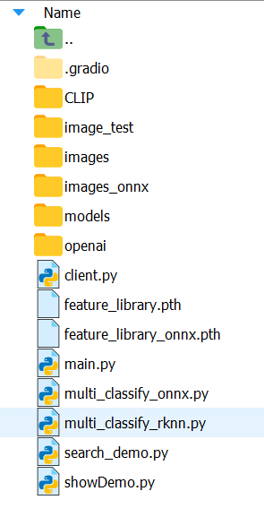

环境配置：（conda）
python 3.10
pip install torch(1/7-2.2适配)
pip install transformers
pip install clip
pip install Pillow
(上述安装完，如果缺少依赖包就装啥)

注意：如果遇到“Permission denied”的权限错误，则先执行“sudo -i”切换权限

git clone https://github.com/openai/CLIP
进入CLIP文件夹后执行命令：pip install .

选择我们想要的模型，这里选择clip-vit-base-patch32
（模型地址：https://huggingface.co/openai/clip-vit-base-patch32/tree/main）
github地址：https://github.com/openai/CLIP  
将他们下载到openai/clip-vit-base-patch32中（如果有良好的huggingface连接，也可以直接加载远程下载）

最终形成的目录结构：

image_test文件夹存放的是我们要进行图像分类的图片；
images_onnx文件夹存放的是我们的onnx模型的图片数据库；
images_rknn文件夹存放的是我们的rknn模型的图片数据库；
feature_library1.pth存放的是onnx模型的图片的向量数据库；
feature_library2.pth存放的是rknn模型的图片的向量数据库；
search_onnx.py是onnx模型实现文本搜索图片的脚本demo；
search_rknn.py是rknn模型实现文本搜索图片的脚本demo；
main.py是实现指定图像分类的脚本demo；
multi_classify_onnx.py是对image_test文件夹中的所有图片利用onnx模型进行分类；
multi_classify_rknn.py是对image_test文件夹中的所有图片利用rknn模型进行分类；

不过值得注意的是上述文件未开放命令行，可根据实际需求添加。

RKNN环境配置：（uname -m 输出当前处理器架构）
https://github.com/airockchip/rknn-toolkit2/blob/master/rknn-toolkit2/packages/arm64/rknn_toolkit2-2.3.0-cp310-cp310-manylinux_2_17_aarch64.manylinux2014_aarch64.whl
在上述网址选择恰当的版本和rknn版本，这里选择的是arm64_requirements_cp310.txt和rknn_toolkit2-2.3.0-cp310-cp310-manylinux_2_17_aarch64.manylinux2014_aarch64.whl以及rknn_toolkit_lite2-2.3.0-cp310-cp310-manylinux_2_17_aarch64.manylinux2014_aarch64.whl；前两者是C++，后者是python，但都需要安装。
其中要注意的是rknn2.3.0需要torch版本是2.2，而torchvision会和torch冲突，所以首先安装好对应的rknn环境之后，选择torchvision版本为0.17进行安装（会自动统一安装torch）

此外，安装前两个C++包的时候需要用到cmake，cmake的安装可以参照下面的链接：（选择第三种最为便捷）https://blog.csdn.net/Man_1man/article/details/126467371

参考文献：
1.https://clehaxze.tw/gemlog/2023/07-15-inexhaustive-list-of-models-that-works-on-rk3588.gmi
2.https://github.com/jina-ai/clip-as-service/blob/main/server/clip_server/model/clip_onnx.py
